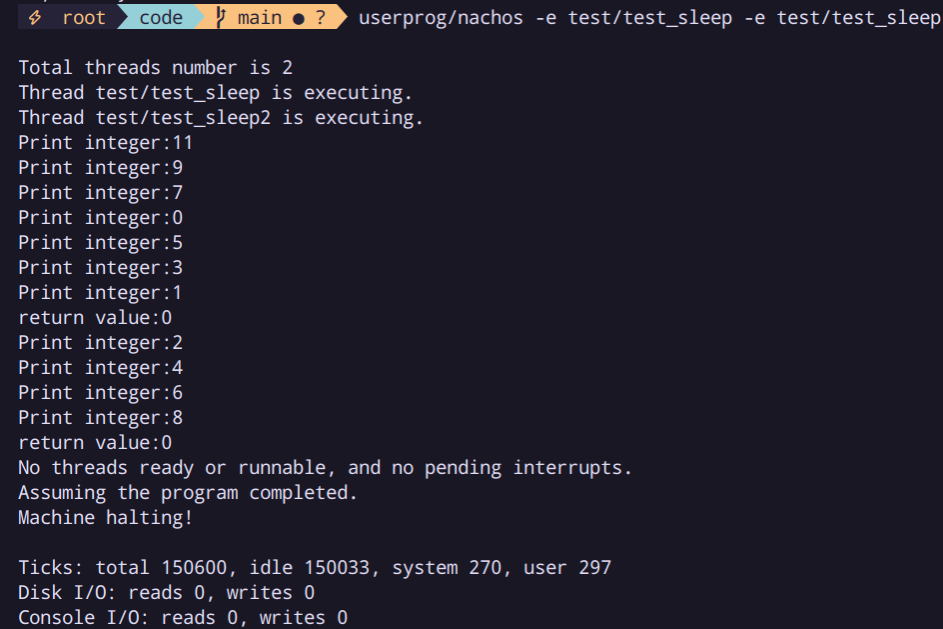

# OS HW 2
# System Call - sleep()

## **Explain the details of code snippet you added or modified**

首先照著投影片的提示，修改 `code/userprog/syscall.h` `code/test/start.S` 這兩個檔案

### syscall.h

在這個檔案 header file 定義了 syscall code 和 function prototype，所以我們也在這裡加入我們的 syscall

```cpp
#define SC_Sleep 12

void Sleep(int time);
```

### start.S

這裡照著 **PrintInt** 的格式加入我們 syscall 的組語

```nasm
PrintInt:
	addiu   $2,$0,SC_PrintInt
	syscall
	j       $31
	.end PrintInt
	
	.globl  Sleep
	.ent    Sleep
Sleep:
	addiu $2,$0,SC_Sleep
	syscall
	j       $31
	.end Sleep
```

syscall 加入完成後，我們要在 code/userprog/exception.cc 加入 syscall 呼叫後的動作

### exception.cc

觀察 SC_PrintInt 可以發現傳入的參數會存在 register 4，然後傳入 WaitUntil 實作 sleep

```cpp
void ExceptionHandler(ExceptionType which) {
        int type = kernel -> machine -> ReadRegister(2);
        int val;

        switch (which) {
        case SyscallException:
            switch (type) {
            case SC_Sleep:
                // cout<<"Calling SC_Sleep"<<endl;
                val = kernel -> machine -> ReadRegister(4);
                kernel -> alarm -> WaitUntil(val);
                return;

            case SC_Halt:
                DEBUG(dbgAddr, "Shutdown, initiated by user program.\n");
                kernel -> interrupt -> Halt();
                break;
            case SC_PrintInt:
                val = kernel -> machine -> ReadRegister(4);
                cout << "Print integer:" << val << endl;
                return;
						
						...
```

再來觀察 `code/threads/alarm.h` 和 `code/threads/alarm.cc` 可以知道 WaitUntil() 可以讓 thread sleep，然後 Alarm 裡的 Timer 會每過一段時間傳送一個 interrupt 給 OS，OS收到後會用 CallBack() 來 Handle 這個 interrupt，所以我們可以在 CallBack 裡檢查 thread 的睡眠時間是否到期。

所以在實作 alarm 之前，我們要先建立一個 class 來儲存這些要 sleep 的 thread

### scheduler.h

先建立一個 class 來儲存 thread 的資訊，裡面包涵要 sleep 的 thread 和要 sleep 結束的時間

這邊 `overload ==` 和 `compareT(…)` 是為了之後用 SortedList 儲存資料會使用到

```cpp
class SleepThreads{
	public:
		SleepThreads(Thread *t,int time):thread(t),finishTime(time){};
		SleepThreads(){};
		bool operator==(const SleepThreads &obj){ return obj.thread==thread;}

		Thread *thread;
		int finishTime;
};

int CompareT(SleepThreads a,SleepThreads b); 
```

再建立一個 class 把這些 thread 依照 sleep 結束的時間由近到遠排序

使用 `list.h` 裡的 SortedList 來儲存資料

```cpp
class SleepList{
	public:
		SleepList():curr_time(0){};         //把 curr_time 歸零
		void addToSleep(Thread *,int);      //把 thread 跟 sleep 時間加入 List
		bool checkSleep();                  //檢查是否有 thread 時間到了
		bool isEmpty();                     //檢查 List 是否為空
		
	private:
		SortedList<SleepThreads> threadList{CompareT};
		int curr_time;                      //目前時間
};
```

### scheduler.cc

把 header file 的 function 補齊

要注意  checkSleep 要 return 是否有 thread 被喚醒，不然在之後的檢查 empty list會有問題，可能導致 timer 提早結束  

```cpp
void SleepList::addToSleep(Thread *t,int time){
    DEBUG(dbgThread, "Putting thread " << t->getName() << " to SLEEP for" << time <<" tics" );
    threadList.Insert(SleepThreads(t,curr_time+time));    //加上 curr_time 為要喚醒的時間
    t->Sleep(false);
}
		
bool SleepList::checkSleep(){
    bool running=0;
    curr_time++;        // 被呼叫代表 timer interrupt 一次，time++
    while(!isEmpty()&&curr_time>=threadList.Front().finishTime){   //如果有 thread 要被喚醒
        running = 1;
        SleepThreads wakeup = threadList.RemoveFront();
        kernel->scheduler->ReadyToRun(wakeup.thread);
		DEBUG(dbgThread, "Thread woken and put to ready: " << wakeup.thread->getName());
    }
    return running;
}

bool SleepList::isEmpty(){
    return threadList.IsEmpty();
}

int CompareT(SleepThreads a,SleepThreads b){
    if(a.finishTime>b.finishTime)
        return 1;
    if(a.finishTime<b.finishTime)
        return -1;
    return 0;
}
```

### alarm.h

在 alarm 裡加入剛才定義的 SleepList

```cpp
#include "scheduler.h"

// The following class defines a software alarm clock. 
class Alarm : public CallBackObj {
  public:
    Alarm(bool doRandomYield);	// Initialize the timer, and callback 
				// to "toCall" every time slice.
    ~Alarm() { delete timer; }
    
    void WaitUntil(int x);	// suspend execution until time > now + x

  private:
    Timer *timer;		// the hardware timer device
    SleepList sleeplist;
    void CallBack();		// called when the hardware
				// timer generates an interrupt
};
```

### alarm.cc

把 CallBack() 和 WaitUntil() 做修改

要注意 Callback 中有一個 if case來判斷是否要關掉 Timer，除了檢查 SleepList 之外還要檢查是否有 thread 正在執行，確認沒有 thread 在執行才把 timer 停止

```cpp
void Alarm::CallBack() {
    Interrupt * interrupt = kernel -> interrupt;
    MachineStatus status = interrupt -> getStatus();
    bool running = sleeplist.checkSleep();

    if (!running && status == IdleMode && sleeplist.isEmpty()) { // is it time to quit?
        if (!interrupt -> AnyFutureInterrupts()) {
            timer -> Disable(); // turn off the timer
        }
    } else { // there's someone to preempt
        interrupt -> YieldOnReturn();
    }
}

void Alarm::WaitUntil(int x) {
    IntStatus oldLevel = kernel -> interrupt -> SetLevel(IntOff);
    Thread * t = kernel -> currentThread;
    sleeplist.addToSleep(t, x);
    kernel -> interrupt -> SetLevel(oldLevel);
}
```

## **Experiment result and some discussion, observation**

### Test 1

同時跑兩個程式，分別 Sleep(999) 跟 Sleep(5000)，這樣理論上結果會是 Sleep(999) PrintInt 5 次後會讓 Sleep(5000) PrintInt 一次。

**sleep1.c**

```cpp
#include "syscall.h"

main(){
	int i;

	for(i=0;i<100;i++){
		Sleep(999);
		PrintInt(999);
	}
}
```

**sleep2.c**

```cpp
#include "syscall.h"

main(){
	int i;

	for(i=0;i<20;i++){
		Sleep(5000);
		PrintInt(5000);
	}
}
```

**Result**

```bash
$root userprog/nachos -e test/test_sleep -e test/test_sleep2
Total threads number is 2
Thread test/test_sleep is executing.
Thread test/test_sleep2 is executing.
Print integer:999
Print integer:999
Print integer:999
Print integer:999
Print integer:999
Print integer:5000
Print integer:999
Print integer:999
Print integer:999
Print integer:999
Print integer:999
Print integer:5000
Print integer:999
Print integer:999
Print integer:999
Print integer:999
Print integer:999
Print integer:5000
...
```

### Test 2

使用助教給的 code

**test_sleep.c**

```cpp
#include "syscall.h"

main()
{
	int i;
	for (i = 11; i > 0; i-=2) {
		Sleep(99);
		PrintInt(i);
	}
}
```

**test_sleep2.c**

```cpp
#include "syscall.h"

main()
{
	int i;
	for (i = 0; i <= 8; i+=2) {
		Sleep(301);
		PrintInt(i);
	}
}
```

**Result**



## **What problem you face and tackle it ?**

如同上面 Implement 介紹所述，一開始我 checkSleep 沒有 return value，這會導致 timer 被提早關閉

```cpp
void Alarm::CallBack() {
    Interrupt * interrupt = kernel -> interrupt;
    MachineStatus status = interrupt -> getStatus();
    bool running = sleeplist.checkSleep();

    if (!running && status == IdleMode && sleeplist.isEmpty()) { // is it time to quit?
        if (!interrupt -> AnyFutureInterrupts()) {
            timer -> Disable(); // turn off the timer
        }
    } else { // there's someone to preempt
        interrupt -> YieldOnReturn();
    }
}
```

### 解決方法

在 checkSleep 新增 return value，如果有程式被喚醒執行就 return 1，這樣就算 Sleeplist 為 empty timer 也不會馬上被刪除。

## Questions

### **Explain the details of function call path from Machine::Run to Alarm::CallBack()**

先在 gdb 執行 `sleep_test.c` 並設定 breakpoint 在 Alarm::CallBack()

run 後看 backtrace 得到以下結果

```cpp
gdb-peda$ b Alarm::CallBack
gdb-peda$ r -e test/test_sleep
gdb-peda$ bt
#0  Alarm::CallBack (this=0x90f4f30) at ../threads/alarm.cc:51
#1  0x0804e7ee in Timer::CallBack (this=0x90f4f58) at ../machine/timer.cc:55
#2  0x0804d748 in Interrupt::CheckIfDue (this=0x90f4ad0, advanceClock=0x1) at ../machine/interrupt.cc:312
#3  0x0804d309 in Interrupt::Idle (this=0x90f4ad0) at ../machine/interrupt.cc:212
#4  0x080534af in Thread::Sleep (this=0x90f6258, finishing=0x0) at ../threads/thread.cc:251
#5  0x08050dc0 in SleepList::addToSleep (this=0x90f4f38, t=0x90f6258, time=0x63) at ../threads/scheduler.cc:215
#6  0x0804eb17 in Alarm::WaitUntil (this=0x90f4f30, x=0x63) at ../threads/alarm.cc:70
#7  0x08056bdd in ExceptionHandler (which=SyscallException) at ../userprog/exception.cc:62
#8  0x08057a65 in Machine::RaiseException (this=0x90f5180, which=SyscallException, badVAddr=0x0)
    at ../machine/machine.cc:111
#9  0x08059bca in Machine::OneInstruction (this=0x90f5180, instr=0x90fa5e8) at ../machine/mipssim.cc:556
#10 0x080580db in Machine::Run (this=0x90f5180) at ../machine/mipssim.cc:63
...
```

靜態的 trace code 和用 debug flag 印出的資訊可以知道，當 Machine 執行到 sleep 這個 system call 時，會 Raise 一個 SystemCall Exception，然後 ExceptionHandler 會針對 SC_Sleep 這個 case 呼叫 Alarm::WaitUntil 。當 Alarm 被 set，這時 Timer 會固定一段時間 Interrupt，這時就會執行 Alarm::CallBack 當作回應。 

# **CPU scheduling**

## What is your plan?

我打算實作以下幾種 scheduler

```cpp
enum SchedulerType {
    RR,  // Round Robin
    SJF,
    Priority,
    FCFS
};
```

先實作最基本的 FCFS，把整個 scheduler 架構建立起來後確認結果無誤，再完成其他較複雜的方法。

## Explain the details of code snippet you added or modified.

首先先看 `thread/main.cc` 可以發現 thread 內的 main 會先建立一個 kernel ，再執行 `kernel→SelfTest()` ， kernel 內的 SelfTest() 會再呼叫 `Thread→SelfTest()`，所以我選擇把測試 code 寫在 `Thread::SelfTest()` 中

### Thread.h

thread 要進行排序會需要用的資訊為 priority, burstTime, joinTime，把這三個加入 private 並且加入對應的 public function

```cpp
class Thread
{
public:
		...
		int getPriority() { return priority; }
    int getBurstTime() { return burstTime; }
    int getJoinTime() { return joinTime; }
    void setPriority(int pri) { priority = pri; }
    void setBurstTime(int time) { burstTime = time; }
    void setJoinTime(int time) { joinTime = time; }

private:
    // some of the private data for this class is listed above
    int priority;
    int burstTime;
    int joinTime;
		...
}
```

### Thread.cc

修改 SelfTest 跟 SimpleThread， SelfTest 執行時會建立 5 個 thread 和對應的 priority, burstTime, joinTime，而他們執行的 func 為 SimpleThread，會遞減並印出 burstTime 模擬程式執行。

```cpp
void Thread::SelfTest()
{
    DEBUG(dbgThread, "Entering Thread::SelfTest");
    Thread *t;
    int threadNum = 5;
    char *name[threadNum] = {"A", "B", "C", "D", "E"};
    int joinTime[threadNum] = {1, 2, 3, 4, 5};
    int burstTime[threadNum] = {15, 20, 25, 10, 5};
    int priority[threadNum] = {5, 4, 3, 2, 1};

    for (int i = 0; i < threadNum; i++) {
        t = new Thread(name[i]);
        t->setJoinTime(joinTime[i]);
        t->setBurstTime(burstTime[i]);
        t->setPriority(priority[i]);
        t->Fork((VoidFunctionPtr) SimpleThread, NULL);
    }

    kernel->currentThread->Yield();
}

static void SimpleThread()
{
    Thread *curr_thread = kernel->currentThread;

    while (curr_thread->getBurstTime() > 0) {
        curr_thread->setBurstTime(curr_thread->getBurstTime() - 1);
        cout << "Running Thread: " << curr_thread->getName()
             << ", Time Left: " << curr_thread->getBurstTime() << endl;
        kernel->interrupt->OneTick();
    }
}
```

### Kernel.cc

在這裡讀入 argv 中的 scheduler 種類並存入 type 變數中（記得在 `thread/kernel.h` 中加入），在 `ThreadedKernel::Initialize()` 中建立新的 scheduler 時傳入 type

```cpp
ThreadedKernel::ThreadedKernel(int argc, char **argv)
{
    randomSlice = FALSE;
    type = FCFS;

    for (int i = 1; i < argc; i++) {
        if (strcmp(argv[i], "-rs") == 0) {
            ASSERT(i + 1 < argc);
            RandomInit(atoi(argv[i + 1]));  // initialize pseudo-random
                                            // number generator
            randomSlice = TRUE;
            i++;
        } else if (strcmp(argv[i], "-u") == 0) {
            cout << "Partial usage: nachos [-rs randomSeed]\n";
        } else if (strcmp(argv[i], "-scheduler") == 0) {
            i++;
            if (strcmp(argv[i], "RR") == 0)
                type = RR;
            else if (strcmp(argv[i], "FCFS") == 0)
                type = FCFS;
            else if (strcmp(argv[i], "Priority") == 0)
                type = Priority;
            else if (strcmp(argv[i], "SJF") == 0)
                type = SJF;
            else
                cout << "Invalid scheduler" << endl;
        }
    }
}

void ThreadedKernel::Initialize()
{
    stats = new Statistics();        // collect statistics
    interrupt = new Interrupt;       // start up interrupt handling
    scheduler = new Scheduler(type);     // 更改這裡
    alarm = new Alarm(randomSlice);  // start up time slicing

    // We didn't explicitly allocate the current thread we are running in.
    // But if it ever tries to give up the CPU, we better have a Thread
    // object to save its state.
    currentThread = new Thread("main");
    currentThread->setStatus(RUNNING);

    interrupt->Enable();
}
```

### Scheduler.h

在 SchedulerType 中加入要使用的 schduling algo，還有 compare 用的 function（for SortedList) ，最後新增可以接收 type 的 init function。

```cpp
enum SchedulerType {
    RR,  // Round Robin
    SJF,
    Priority,
    FCFS
};

int FCFScmp(Thread *a, Thread *b);
int Priorcmp(Thread *a, Thread *b);
int SJFcmp(Thread *a, Thread *b);

class Scheduler
{
public:
    Scheduler();
    Scheduler(SchedulerType);
    ...
};
```

### Scheduler.cc

把上述的 function 補齊

```cpp
Scheduler::Scheduler(SchedulerType t)
{
    //	schedulerType = type;
    switch (t) {
    case FCFS:
        readyList = new SortedList<Thread *>(FCFScmp);
        cout << "Using FCFS scheduler" << endl;
        break;
    case RR:
        readyList = new List<Thread *>;
        cout << "Using RR scheduler" << endl;
        break;
    case Priority:
        readyList = new SortedList<Thread *>(Priorcmp);
        cout << "Using Priority scheduler" << endl;
        break;
    case SJF:
        readyList = new SortedList<Thread *>(SJFcmp);
        cout << "Using SJF scheduler" << endl;
        break;
    }
    toBeDestroyed = NULL;
}

int FCFScmp(Thread *a, Thread *b)
{
    if (a->getJoinTime() < b->getJoinTime())
        return -1;
    else if ((a->getJoinTime() > b->getJoinTime()))
        return 1;
    else
        return 0;
}

int Priorcmp(Thread *a, Thread *b)
{
    if (a->getPriority() < b->getPriority())
        return -1;
    else if (a->getPriority() > b->getPriority())
        return 1;
    else
        return 0;
}

int SJFcmp(Thread *a, Thread *b)
{
    if (a->getBurstTime() < b->getBurstTime())
        return -1;
    else if (a->getBurstTime() > b->getBurstTime())
        return 1;
    else
        return 0;
}
```

## Experiment result and some discussion, observation

### Thread Setting

```cpp
char *name[threadNum] = {"A", "B", "C", "D", "E"};
int joinTime[threadNum] = {1, 2, 3, 4, 5};
int burstTime[threadNum] = {15, 20, 25, 10, 5};
int priority[threadNum] = {5, 4, 3, 2, 1};
```

### FCFS

由於這五個 Thread 的 joinTime 分別為 `{1, 2, 3, 4, 5}`，所以 FCFS 的排程順序應該為 `{"A", "B", "C", "D", "E"}`

```bash
./nachos -scheduler FCFS
Using FCFS scheduler
Running Thread: A, Time Left: 14
Running Thread: A, Time Left: 13
Running Thread: A, Time Left: 12
Running Thread: A, Time Left: 11
Running Thread: A, Time Left: 10
Running Thread: A, Time Left: 9
Running Thread: A, Time Left: 8
Running Thread: A, Time Left: 7
Running Thread: A, Time Left: 6
Running Thread: A, Time Left: 5
Running Thread: A, Time Left: 4
Running Thread: A, Time Left: 3
Running Thread: A, Time Left: 2
Running Thread: A, Time Left: 1
Running Thread: A, Time Left: 0
Running Thread: B, Time Left: 19
Running Thread: B, Time Left: 18
Running Thread: B, Time Left: 17
Running Thread: B, Time Left: 16
Running Thread: B, Time Left: 15
Running Thread: B, Time Left: 14
Running Thread: B, Time Left: 13
Running Thread: B, Time Left: 12
Running Thread: B, Time Left: 11
Running Thread: B, Time Left: 10
Running Thread: B, Time Left: 9
Running Thread: B, Time Left: 8
Running Thread: B, Time Left: 7
Running Thread: B, Time Left: 6
Running Thread: B, Time Left: 5
Running Thread: B, Time Left: 4
Running Thread: B, Time Left: 3
Running Thread: B, Time Left: 2
Running Thread: B, Time Left: 1
Running Thread: B, Time Left: 0
Running Thread: C, Time Left: 24
Running Thread: C, Time Left: 23
Running Thread: C, Time Left: 22
Running Thread: C, Time Left: 21
Running Thread: C, Time Left: 20
Running Thread: C, Time Left: 19
Running Thread: C, Time Left: 18
Running Thread: C, Time Left: 17
Running Thread: C, Time Left: 16
Running Thread: C, Time Left: 15
Running Thread: C, Time Left: 14
Running Thread: C, Time Left: 13
Running Thread: C, Time Left: 12
Running Thread: C, Time Left: 11
Running Thread: C, Time Left: 10
Running Thread: C, Time Left: 9
Running Thread: C, Time Left: 8
Running Thread: C, Time Left: 7
Running Thread: C, Time Left: 6
Running Thread: C, Time Left: 5
Running Thread: C, Time Left: 4
Running Thread: C, Time Left: 3
Running Thread: C, Time Left: 2
Running Thread: C, Time Left: 1
Running Thread: C, Time Left: 0
Running Thread: D, Time Left: 9
Running Thread: D, Time Left: 8
Running Thread: D, Time Left: 7
Running Thread: D, Time Left: 6
Running Thread: D, Time Left: 5
Running Thread: D, Time Left: 4
Running Thread: D, Time Left: 3
Running Thread: D, Time Left: 2
Running Thread: D, Time Left: 1
Running Thread: D, Time Left: 0
Running Thread: E, Time Left: 4
Running Thread: E, Time Left: 3
Running Thread: E, Time Left: 2
Running Thread: E, Time Left: 1
Running Thread: E, Time Left: 0
No threads ready or runnable, and no pending interrupts.
Assuming the program completed.
Machine halting!
```

### Priority

由於這五個 Thread 的 priority 分別為`{5, 4, 3, 2, 1}`，所以 Priority 的排程順序應該為 `{"E", "D", "C", "B", "A"}`

（數字越小，Prioirity越高）

```bash
./nachos -scheduler Priority
Using Priority scheduler
Running Thread: E, Time Left: 4
Running Thread: E, Time Left: 3
Running Thread: E, Time Left: 2
Running Thread: E, Time Left: 1
Running Thread: E, Time Left: 0
Running Thread: D, Time Left: 9
Running Thread: D, Time Left: 8
Running Thread: D, Time Left: 7
Running Thread: D, Time Left: 6
Running Thread: D, Time Left: 5
Running Thread: D, Time Left: 4
Running Thread: D, Time Left: 3
Running Thread: D, Time Left: 2
Running Thread: D, Time Left: 1
Running Thread: D, Time Left: 0
Running Thread: C, Time Left: 24
Running Thread: C, Time Left: 23
Running Thread: C, Time Left: 22
Running Thread: C, Time Left: 21
Running Thread: C, Time Left: 20
Running Thread: C, Time Left: 19
Running Thread: C, Time Left: 18
Running Thread: C, Time Left: 17
Running Thread: C, Time Left: 16
Running Thread: C, Time Left: 15
Running Thread: C, Time Left: 14
Running Thread: C, Time Left: 13
Running Thread: C, Time Left: 12
Running Thread: C, Time Left: 11
Running Thread: C, Time Left: 10
Running Thread: C, Time Left: 9
Running Thread: C, Time Left: 8
Running Thread: C, Time Left: 7
Running Thread: C, Time Left: 6
Running Thread: C, Time Left: 5
Running Thread: C, Time Left: 4
Running Thread: C, Time Left: 3
Running Thread: C, Time Left: 2
Running Thread: C, Time Left: 1
Running Thread: C, Time Left: 0
Running Thread: B, Time Left: 19
Running Thread: B, Time Left: 18
Running Thread: B, Time Left: 17
Running Thread: B, Time Left: 16
Running Thread: B, Time Left: 15
Running Thread: B, Time Left: 14
Running Thread: B, Time Left: 13
Running Thread: B, Time Left: 12
Running Thread: B, Time Left: 11
Running Thread: B, Time Left: 10
Running Thread: B, Time Left: 9
Running Thread: B, Time Left: 8
Running Thread: B, Time Left: 7
Running Thread: B, Time Left: 6
Running Thread: B, Time Left: 5
Running Thread: B, Time Left: 4
Running Thread: B, Time Left: 3
Running Thread: B, Time Left: 2
Running Thread: B, Time Left: 1
Running Thread: B, Time Left: 0
Running Thread: A, Time Left: 14
Running Thread: A, Time Left: 13
Running Thread: A, Time Left: 12
Running Thread: A, Time Left: 11
Running Thread: A, Time Left: 10
Running Thread: A, Time Left: 9
Running Thread: A, Time Left: 8
Running Thread: A, Time Left: 7
Running Thread: A, Time Left: 6
Running Thread: A, Time Left: 5
Running Thread: A, Time Left: 4
Running Thread: A, Time Left: 3
Running Thread: A, Time Left: 2
Running Thread: A, Time Left: 1
Running Thread: A, Time Left: 0
No threads ready or runnable, and no pending interrupts.
Assuming the program completed.
Machine halting!
```

### SJF

由於這五個 Thread 的 BurstTime 分別為 `{15, 20, 25, 10, 5}`，所以 Priority 的排程順序應該為 `{"E", "D", "A", "B", "C"}`

```bash
./nachos -scheduler SJF
Using SJF scheduler
Running Thread: E, Time Left: 4
Running Thread: E, Time Left: 3
Running Thread: E, Time Left: 2
Running Thread: E, Time Left: 1
Running Thread: E, Time Left: 0
Running Thread: D, Time Left: 9
Running Thread: D, Time Left: 8
Running Thread: D, Time Left: 7
Running Thread: D, Time Left: 6
Running Thread: D, Time Left: 5
Running Thread: D, Time Left: 4
Running Thread: D, Time Left: 3
Running Thread: D, Time Left: 2
Running Thread: D, Time Left: 1
Running Thread: D, Time Left: 0
Running Thread: A, Time Left: 14
Running Thread: A, Time Left: 13
Running Thread: A, Time Left: 12
Running Thread: A, Time Left: 11
Running Thread: A, Time Left: 10
Running Thread: A, Time Left: 9
Running Thread: A, Time Left: 8
Running Thread: A, Time Left: 7
Running Thread: A, Time Left: 6
Running Thread: A, Time Left: 5
Running Thread: A, Time Left: 4
Running Thread: A, Time Left: 3
Running Thread: A, Time Left: 2
Running Thread: A, Time Left: 1
Running Thread: A, Time Left: 0
Running Thread: B, Time Left: 19
Running Thread: B, Time Left: 18
Running Thread: B, Time Left: 17
Running Thread: B, Time Left: 16
Running Thread: B, Time Left: 15
Running Thread: B, Time Left: 14
Running Thread: B, Time Left: 13
Running Thread: B, Time Left: 12
Running Thread: B, Time Left: 11
Running Thread: B, Time Left: 10
Running Thread: B, Time Left: 9
Running Thread: B, Time Left: 8
Running Thread: B, Time Left: 7
Running Thread: B, Time Left: 6
Running Thread: B, Time Left: 5
Running Thread: B, Time Left: 4
Running Thread: B, Time Left: 3
Running Thread: B, Time Left: 2
Running Thread: B, Time Left: 1
Running Thread: B, Time Left: 0
Running Thread: C, Time Left: 24
Running Thread: C, Time Left: 23
Running Thread: C, Time Left: 22
Running Thread: C, Time Left: 21
Running Thread: C, Time Left: 20
Running Thread: C, Time Left: 19
Running Thread: C, Time Left: 18
Running Thread: C, Time Left: 17
Running Thread: C, Time Left: 16
Running Thread: C, Time Left: 15
Running Thread: C, Time Left: 14
Running Thread: C, Time Left: 13
Running Thread: C, Time Left: 12
Running Thread: C, Time Left: 11
Running Thread: C, Time Left: 10
Running Thread: C, Time Left: 9
Running Thread: C, Time Left: 8
Running Thread: C, Time Left: 7
Running Thread: C, Time Left: 6
Running Thread: C, Time Left: 5
Running Thread: C, Time Left: 4
Running Thread: C, Time Left: 3
Running Thread: C, Time Left: 2
Running Thread: C, Time Left: 1
Running Thread: C, Time Left: 0
```

### RR

Round-Robin 執行時會在固定時間把沒做完的 程式停止並排到 List 的最後，所以執行順序應該為 A, B, C, D, E, A, B, C …

```bash
./nachos -scheduler RR
Using RR scheduler
Running Thread: A, Time Left: 14
Running Thread: A, Time Left: 13
Running Thread: A, Time Left: 12
Running Thread: B, Time Left: 19
Running Thread: B, Time Left: 18
Running Thread: B, Time Left: 17
Running Thread: B, Time Left: 16
Running Thread: B, Time Left: 15
Running Thread: B, Time Left: 14
Running Thread: B, Time Left: 13
Running Thread: B, Time Left: 12
Running Thread: B, Time Left: 11
Running Thread: C, Time Left: 24
Running Thread: C, Time Left: 23
Running Thread: C, Time Left: 22
Running Thread: C, Time Left: 21
Running Thread: C, Time Left: 20
Running Thread: C, Time Left: 19
Running Thread: C, Time Left: 18
Running Thread: C, Time Left: 17
Running Thread: C, Time Left: 16
Running Thread: D, Time Left: 9
Running Thread: D, Time Left: 8
Running Thread: D, Time Left: 7
Running Thread: D, Time Left: 6
Running Thread: D, Time Left: 5
Running Thread: D, Time Left: 4
Running Thread: D, Time Left: 3
Running Thread: D, Time Left: 2
Running Thread: D, Time Left: 1
Running Thread: E, Time Left: 4
Running Thread: E, Time Left: 3
Running Thread: E, Time Left: 2
Running Thread: E, Time Left: 1
Running Thread: E, Time Left: 0
Running Thread: B, Time Left: 10
Running Thread: B, Time Left: 9
Running Thread: B, Time Left: 8
Running Thread: B, Time Left: 7
Running Thread: B, Time Left: 6
Running Thread: B, Time Left: 5
Running Thread: B, Time Left: 4
Running Thread: B, Time Left: 3
Running Thread: B, Time Left: 2
Running Thread: C, Time Left: 15
Running Thread: C, Time Left: 14
Running Thread: C, Time Left: 13
Running Thread: C, Time Left: 12
Running Thread: C, Time Left: 11
Running Thread: C, Time Left: 10
Running Thread: C, Time Left: 9
Running Thread: C, Time Left: 8
Running Thread: C, Time Left: 7
Running Thread: D, Time Left: 0
Running Thread: A, Time Left: 11
Running Thread: A, Time Left: 10
Running Thread: A, Time Left: 9
Running Thread: A, Time Left: 8
Running Thread: B, Time Left: 1
Running Thread: B, Time Left: 0
Running Thread: C, Time Left: 6
Running Thread: C, Time Left: 5
Running Thread: C, Time Left: 4
Running Thread: C, Time Left: 3
Running Thread: C, Time Left: 2
Running Thread: C, Time Left: 1
Running Thread: A, Time Left: 7
Running Thread: A, Time Left: 6
Running Thread: A, Time Left: 5
Running Thread: A, Time Left: 4
Running Thread: A, Time Left: 3
Running Thread: A, Time Left: 2
Running Thread: A, Time Left: 1
Running Thread: C, Time Left: 0
Running Thread: A, Time Left: 0
```

## What problem you face and tackle it?

在執行 FCFS 時我發現執行結果比較像是 RR，打開 debug 模式發現程式每執行一段時間會執行 Thread::Yield()，這會讓他把目前的 Thread 暫停後加回去 ReadyList 中，但由於我的 compare function 固定 return 1，代表後加入的 thread 一定會排在後面，這導致我的結果變 RR

```cpp
void Thread::Yield()
{
    Thread *nextThread;
    IntStatus oldLevel = kernel->interrupt->SetLevel(IntOff);

    ASSERT(this == kernel->currentThread);

    DEBUG(dbgThread, "Yielding thread: " << name);

    nextThread = kernel->scheduler->FindNextToRun();
    if (nextThread != NULL) {
        kernel->scheduler->ReadyToRun(this);
        kernel->scheduler->Run(nextThread, FALSE);
    }
    (void) kernel->interrupt->SetLevel(oldLevel);
}
```

### 解決方法

讓 SortedList 依加入時間排序，而不是直接 return 1

```cpp
int FCFScmp(Thread *a, Thread *b)
{
    if (a->getJoinTime() < b->getJoinTime())
        return -1;
    else if ((a->getJoinTime() > b->getJoinTime()))
        return 1;
    else
        return 0;
}
```